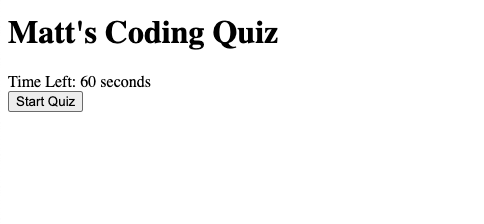

# Coding-Quiz
Timed quiz webpage on Javascript fundamentals

This webpage is a multiple choice quiz on JavaScript trivia including a start button, 
a 60 second timer that ends the quiz when it reaches zero, a next button and the option
to save the user's initials and results to the window application local storage. If the 
user gets the question wrong, the timer will subtract 10 seconds from the remaining 
time. 

